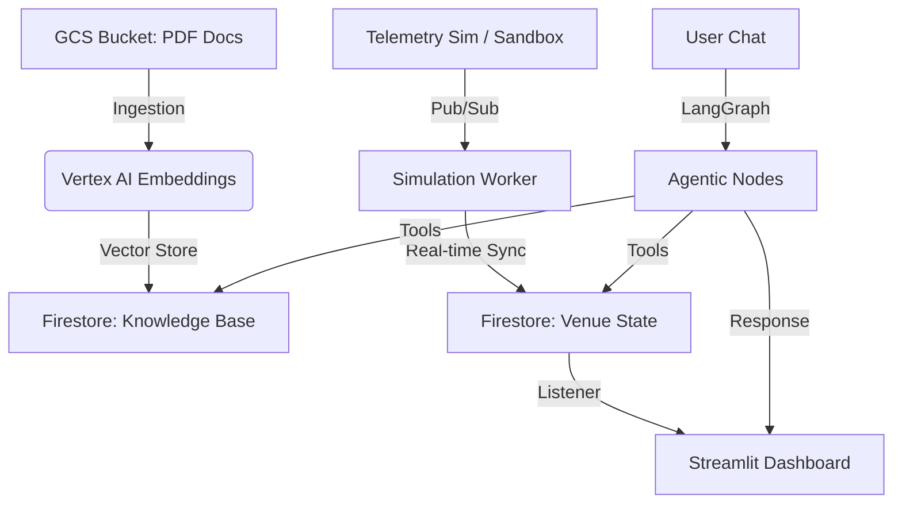

# 🏟️ EventFlow: AI-Powered multi-agent Physical Event Experience Orchestrator

> **Use Case and Solution Brief:** 
We solve the two biggest challenges of live events: seamless operational control and personalized fan experiences by integrating multi-agent architecture with RAG and MCP tools with real-time telemetry data.

Our solution, EventFlow AI is a real-time Digital Twin and Autonomous Orchestration engine built for ultra-scale events and venue management that assists both attendees and event managers by combining **GCP Enterprise services** with a **Dual-Persona Agentic Swarm**. It bridges the gap between the physical venue and the digital experience, providing real-time insights and control to managers while offering personalized assistance to attendees.

---

## 🚀 Core Value Propositions

### 🛰️ Real-Time Digital Twin Dashboard
Monitor gates, concessions, facilities, and parking in a unified, high-fidelity monitoring interface. Our **RAG-Indicator System** (Red, Amber, Green) uses glowing borders and real-time telemetry to highlight bottlenecks before they become security risks.

### 🧠 Dual-Persona Agentic Swarm
Built on **LangGraph** and **GCP Vertex AI**, our agents are not just chatbots—they are active orchestrators:
- **📊 Event Manager:** Commands the stadium state. "Shut Gate D" translates instantly to Firestore-synced Digital Twin updates across all dashboards.
- **🎫 AI Concierge:** Provides hyper-personalized fan support, searching our high-fidelity Knowledge Base for policies, transit routes, and medical help.

### ☣️ Operational Chaos Sandbox
A built-in **Simulation Engine** allows managers to inject stressors (Vendor Slowdowns, Facility Closures, Gate Failures) to observe real-time telemetry impact and agentic response strategies.

---

## 🏗️ Technical Architecture

EventFlow AI utilizes a strictly decoupled, event-driven architecture powered by Google Cloud.



---

## 🛠️ Tech Stack & GCP Ecosystem

- **Backend:** Python 3.11+, FastAPI, LangGraph.
- **Frontend:** Streamlit with custom High-Fidelity CSS.
- **LLM:** Google Vertex AI (Gemini 2.5 Flash).
- **Vector DB:** Firestore Vector Search (768-dim index).
- **Connectivity:** Pub/Sub for Telemetry Simulation.
- **Infrastructure:** Dockerized containers deployed on **Google Cloud Run**.

---

## File Manifests (Per Sub-Workspace)

### `infra-data/`

```
infra-data/
├── README.md
├── requirements.txt
├── seed_venue_state.py          # Seeds Firestore with initial venue_state doc + subcollections
├── ingest_documents.py          # Reads PDFs from GCS, chunks, embeds (text-embedding-004), writes to knowledge_base
├── scenario_engine.py           # Background loop: publishes baseline telemetry every 30s to Pub/Sub
├── seed_data/
│   ├── gates.json               # Initial gate config (Gate_A through Gate_F)
│   ├── zones.json               # Initial zone config (Section_101 through Section_210)
│   ├── concessions.json         # Initial concession stalls
│   ├── facilities.json          # Initial restrooms & medical stations
│   └── parking.json             # Initial parking lots
└── Dockerfile                   # For scenario_engine Cloud Run job
```

### `backend-mcp/`

```
backend-mcp/
├── README.md
├── requirements.txt
├── pyproject.toml               # Python 3.11+ constraints, mypy strict
├── Dockerfile
├── main.py                      # FastAPI app entry point
├── config.py                    # Env var loader (Google Secret Manager placeholders)
├── mcp_server/
│   ├── __init__.py
│   ├── server.py                # MCP Server registration (all tool definitions)
│   ├── tools_venue.py           # get_venue_state, get_gate_status, get_zone_info, etc.
│   ├── tools_knowledge.py       # search_knowledge_base (vector search)
│   └── tools_pubsub.py          # publish_telemetry
├── agents/
│   ├── __init__.py
│   ├── graph.py                 # LangGraph StateGraph definition + routing logic
│   ├── attendee_node.py         # Attendee concierge node (Gemini Flash + MCP tools)
│   ├── manager_node.py          # Manager analyst node (Gemini Flash + MCP tools)
│   └── state.py                 # TypedDict for LangGraph AgentState
├── api/
│   ├── __init__.py
│   ├── routes_chat.py           # POST /api/v1/chat
│   ├── routes_simulate.py       # POST /api/v1/simulate
│   └── routes_venue.py          # GET /api/v1/venue-state/{event_id}
├── services/
│   ├── __init__.py
│   ├── firestore_client.py      # Async Firestore wrapper
│   ├── pubsub_client.py         # Pub/Sub publisher + subscriber
│   └── vertex_ai_client.py      # Gemini + Embedding model init
└── worker/
    ├── __init__.py
    └── telemetry_subscriber.py  # Pub/Sub pull subscriber → Firestore writer
```

### `frontend-ux/`

```
frontend-ux/
├── README.md
├── requirements.txt
├── Dockerfile
├── .streamlit/
│   └── config.toml              # Theme: dark mode, WCAG 2.1 compliant colors
├── app.py                       # Main Streamlit entry: persona selector
├── pages/
│   ├── 1_🎫_Attendee.py         # Attendee view: chat + live info cards
│   └── 2_📊_Manager.py          # Manager view: dashboard + sandbox controls
├── components/
│   ├── __init__.py
│   ├── chat_panel.py            # Reusable chat UI (sends to /api/v1/chat)
│   ├── venue_cards.py           # Gate/Zone/Concession status cards
│   ├── heatmap.py               # Zone density heatmap visualization
│   ├── sandbox_controls.py      # Sliders → POST /api/v1/simulate
│   └── stage_indicator.py       # Current event stage badge
├── services/
│   ├── __init__.py
│   ├── api_client.py            # HTTP client to backend-mcp
│   └── firestore_listener.py   # on_snapshot() background thread for real-time updates
└── assets/
    └── logo.png                 # EventFlow AI branding
```
---

## ⚙️ Installation & Setup

### 1. Environment Configuration
Create a `.env` file in the root with your GCP credentials:
```env
GOOGLE_CLOUD_PROJECT="your-project-id"
VERTEX_AI_LOCATION="us-central1"
FIRESTORE_DATABASE="(default)"
GCS_DOCS_BUCKET="your-ingestion-bucket"
```

### 2. Knowledge Ingestion
Ensure your PDFs are in GCS, then run our high-fidelity ingestion engine (Powered by PyMuPDF):
```bash
cd infra-data
python ingest_documents.py
```

### 3. Local Development
```bash
# Run Backend (Port 8000)
cd backend-mcp
uvicorn main:app --reload

# Run Frontend (Port 8501)
cd frontend-ux
streamlit run app.py
```

---

## 🚢 Enterprise Deployment

EventFlow AI is optimized for **Google Cloud Run**.

```bash
# Build & Deploy Backend
gcloud builds submit --tag gcr.io/[PROJECT_ID]/eventflow-backend
gcloud run deploy eventflow-backend --image gcr.io/[PROJECT_ID]/eventflow-backend

# Build & Deploy Frontend
gcloud builds submit --tag gcr.io/[PROJECT_ID]/eventflow-frontend
gcloud run deploy eventflow-frontend --image gcr.io/[PROJECT_ID]/eventflow-frontend
```

---

## 🎯 Judging Criteria Alignment

EventFlow AI has been meticulously engineered to exceed the hackathon’s specific evaluation parameters:

### 💎 Code Quality (Structure, Readability, Maintainability)
- **Modern Standards:** Built with Python 3.11+ using **strict type hinting** for robust, self-documenting code.
- **Architectural Excellence:** Implemented a modular **Agentic Swarm** architecture using LangGraph, ensuring clear separation between orchestration logic, tools, and UI components.
- **Reliable Configuration:** Utilized `Pydantic` and `SettingsConfigDict` for secure, environment-driven configuration management.

### 🛡️ Security (Safe & Responsible Implementation)
- **Zero-Footprint Auditing:** Implemented hardened `.gitignore` and `.dockerignore` policies to prevent the leakage of service accounts or API keys into public repositories.
- **Enterprise AI:** Primarily utilizes **Google Vertex AI** (Enterprise tier) rather than public API endpoints, ensuring data privacy and governed access.
- **Technical ID Sanitization:** Prevents unauthorized document creation via a regex-based **ID Resolver** that maps natural language inputs to technical Firestore IDs.

### ⚡ Efficiency (Optimal Resource Utilization)
- **Asynchronous Execution:** The backend is fully asynchronous (`async/await`), enabling high-concurrency handling of real-time telemetry events.
- **Optimized RAG:** Implemented layout-aware PDF extraction and smart vector chunking (1000 chars w/ overlap) to maximize LLM context efficiency and retrieval accuracy.
- **Quota Management:** Built-in **10s rate-limiting breathers** in the ingestion pipeline to proactively prevent `429 RESOURCE_EXHAUSTED` errors.

### 🧪 Testing (Validation of Functionality)
- **Comprehensive Docs:** Hosted in the `/Testing` directory, our documentation detail both **Integration Testing** (system-wide data flow) and **UAT Testing** (feature log & hardening results).
- **Simulation Validation:** The prototype includes a dedicated **Simulation Sandbox** specifically for testing edge-case scenarios on the fly.

### ♿ Accessibility (Inclusive & Usable Design)
- **High-Fidelity Monitoring:** The dashboard uses **WCAG-compliant high-contrast colors** and glowing "Digital Twin" borders (Red-Amber-Green) to ensure critical status alerts are visible at a glance.
- **Responsive Navigation:** Designed with a clean, semantic structure and responsive layouts to support diverse user hardware and roles.

### ☁️ Google Services (Meaningful Integration)
- **Vertex AI:** Powering both the Multi-Persona Gemini 2.5 Flash agents and the high-density Text Embeddings (004).
- **Firestore:** Serving as the Real-time State Store and Vector Database for high-speed policy retrieval.
- **Pub/Sub:** Orchestrating the event bus for telemetry simulation and scenario injection.
- **Cloud Run:** Optimized Dockerized deployment for serverless scalability.

---
